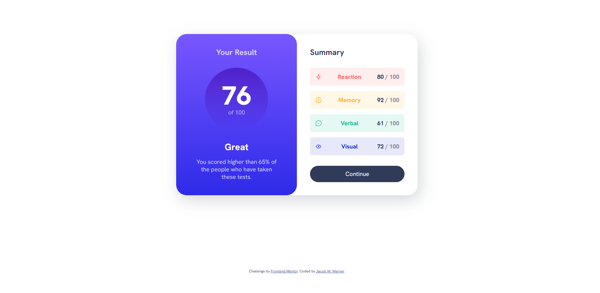

# Frontend Mentor - Results summary component solution

This is a solution to the [Results summary component challenge on Frontend Mentor](https://www.frontendmentor.io/challenges/results-summary-component-CE_K6s0maV). Frontend Mentor challenges help you improve your coding skills by building realistic projects.

## Table of contents

- [Overview](#overview)
  - [The challenge](#the-challenge)
  - [Screenshot](#screenshot)
  - [Links](#links)
- [My process](#my-process)
  - [Built with](#built-with)
  - [What I learned](#what-i-learned)
  - [Continued development](#continued-development)
  - [Useful resources](#useful-resources)
- [Author](#author)
- [Acknowledgments](#acknowledgments)

## Overview

### The challenge

Users should be able to:

- View the optimal layout for the interface depending on their device's screen size
- See hover and focus states for all interactive elements on the page
- **Bonus**: Use the local JSON data to dynamically populate the content

### Screenshot

### Links

- Solution URL: (https://www.frontendmentor.io/solutions/results-component-using-bem-and-mixing-flex-and-grid-6bOcDhMoam)
- Live Site URL: (https://jacobwwarner-results-component.netlify.app/)

## My process

### Built with

- Semantic HTML5 markup
- CSS custom properties
- Flexbox
- CSS Grid

### What I learned

Building out this component helped me...
1: ... to see which element layouts can be accomplished with Grid vs Flexbox.
2: ... to understand how to use custom properties in CSS to write efficient, reusable code.
3: ... see how you can create a premade gradient to reuse across multiple components.

## Author

- Website - [Jacob Warner](https://www.jacobwwarner.com)
- Frontend Mentor - [@jacobwwarner](https://www.frontendmentor.io/profile/jacobwwarner)
- Twitter - [@jacobwwarner](https://www.twitter.com/yourusername)

## Acknowledgments

Kevin Powell specializes in teaching CSS and front-end design through various online platforms.
He's helped me appreciate the capabilities of standard CSS when compared to a utility class-based
development framework like Bootstrap or Tailwind.css

- YouTube Channel: (https://www.youtube.com/@KevinPowell)
- Video Link: (https://www.youtube.com/watch?v=KqFAs5d3Yl8&list=PLj9yuxiALbMqB9h8WRNlkP286t2hmCd5V&index=2&t=125s)
